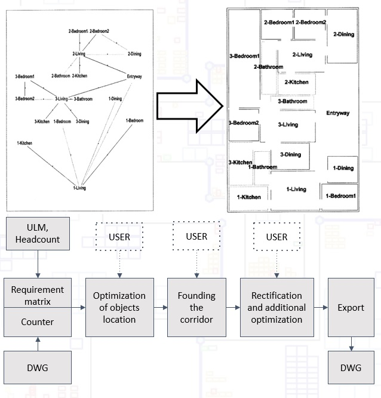
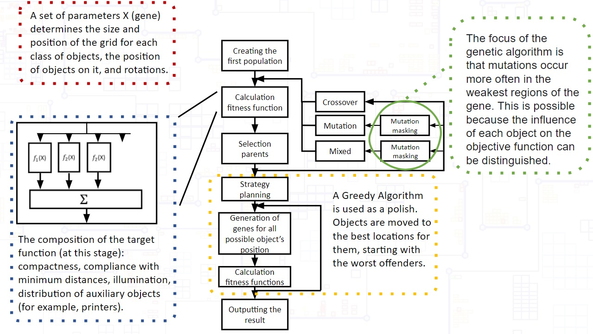
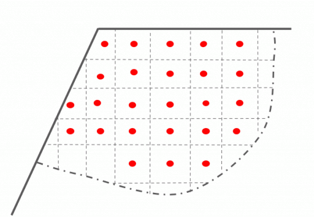

# 
Automated Floor Plan Design

**Оглавление**
1. [Problem](#Problem)
2. [Proposed solution](#solution)
3. [Automated Floor Plan Design](#auto_plan_design)
4. [Algorithm testing](#tests)
5. [In near plans](#plans)
6. [References](#references)

## 
Automated Floor Plan Design Problem

* The problem is to create two-dimensional layouts based on topological, geometrical, functional and esthetic constraints [(1)](#first_reference).
* Because of the combinationally explosive nature of the search problem, it is impossible to search exhaustively to find a solution [(1)](#first_reference).
* The following algorithms were proposed as a solution: Evolution optimization [(2)](#second_reference)-[(3)](#third_reference), Bayesian network [(4)](#forth_reference), Semidefinite optimization, Conves optimization [(5)](#fifth_reference), nonlinear programming model [(6)](#sixth_reference), Simulated annealing [(7)](#seventh_reference), Generative Advesarial Network (GAN) [(8)](#eight_reference).
* The main references is "Hybrid Evolutionary Algorithm applied to Automated Generation", 2019 [(3)](#third_reference).  

 

  

## 
The proposed solution: Directed Evolutionary Optimization + Greedy Algorithm

  

## 
Expectations from the algorithm

* The reverse approach is implemented. Objects are placed first, and then the walls.
* Ability to add new target functions without high cost.
* Problems can be solved: compactness of the plan, rooms and corridors of arbitrary shape, taking into account topological constraints (minimum routes, maximim/minimum distances).

   
  

## 
Testing result

| Test 1 | Test 2 | 
|---|---|
|  |  |
*Compactn. - compactness;
illu. - illumination;
Min. D. - compliance with minimum distances;
M.t.S - distribution of auxiliary objects.*

  

## 
In near plans

* Transformation of the algorithm to the type of NGSA-2. Checking along the Pareto border.
* Adding new target functions (grouping, heat distribution, proximity to wet spots, etc.).
* Trying to speed up the algorithm by introducing neural networks into the stage of generating a new gene.
* Implementation of the solution in CAD software for architects, for example, Revit.
* Improvement of the algorithm in order to generate maximum filling plans.
  

## 
References

[1. Automated design of house-floor layout with distributed planning; Xuejun Cao, Zhijun He, Yunhe Pan, Computer-Aided Design, v. 22(4), 1990, pp. 213-222.](https://www.sciencedirect.com/science/article/abs/pii/001044859090050M)

[2. Architectural layout design optimization, Jeremy j. Michalek, Ruchi Choudhary and Panos Y. Papalambros, Taylor & Francis, 2002, vol. 34(5), pp. 461–484;](https://www.tandfonline.com/doi/abs/10.1080/03052150214016)

[3. Hybrid Evolutionary Algorithm applied to Automated Floor Plan Generation, Maciej Nisztuk and Paweł B. Myszkowsk, International Journal of Architectural Computing, 2019, Vol. 17;](https://www.researchgate.net/publication/331718182_Hybrid_Evolutionary_Algorithm_applied_to_Automated_Floor_Plan_Generation)

[4. Computer-Generated Residential Building Layouts, Paul Merrell, Eric Schkufza, Vladlen Koltun, ACM Transactions on Graphics, v. 29(6), 2010.](https://www.researchgate.net/publication/256663544_Computer-Generated_Residential_Building_Layouts)

[5. An Efficient Multiple-Stage Mathematical Programming Method for Advanced Single and MultiFloor Facility Layout Problems, Ahmadi, Abbas and Mohammad Reza Akbari Jokar,  Applied Mathematical Modelling 40(9–10):5605–20., 2016;](https://www.sciencedirect.com/science/article/pii/S0307904X16300026)

[6. An efficient multiple-stage mathematical programming method for advanced single and multi-floor facility layout problems, Abbas Ahmadi, Mohammad Reza Akbari Jokar, Applied Mathematical Modelling 2016;](https://www.sciencedirect.com/science/article/pii/S0307904X16300026)

[7. Performance Based Architectural Design Optimization: Automated 3d Space Layout Using Simulated Annealing, Yi Hwang and Yun Kyu Yi, 2014, (Hemsath 2013):292–99;](https://www.researchgate.net/publication/268514951_PERFORMANCE_BASED_ARCHITECTURAL_DESIGN_OPTIMIZATION_AUTOMATED_3D_SPACE_LAYOUT_USING_SIMULATED_ANNEALING)

[8. Architectural Drawings Recognition and Generation through Machine Learning, Weixin Huang,  Hao Zheng, Conference: Proceedings of the 38th Annual Conference of the Association for Computer Aided Design in Architecture (ACADIA), At: Mexico City, Mexico, 2018.](https://www.researchgate.net/publication/328280126_Architectural_Drawings_Recognition_and_Generation_through_Machine_Learning)
